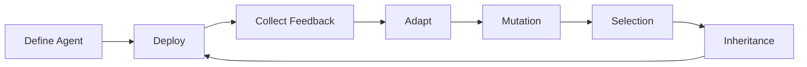

# RootDna

### A Web4-native framework for evolving autonomous intelligence.

---

## 🟠 Official Links

---

## 🌍 Overview

RootDna is a framework for building autonomous agents that continuously learn, adapt, and evolve.  
Instead of static models, RootDna focuses on long-term intelligence, where agents accumulate experience and improve over time.

RootDna enables persistent decision-making systems designed for dynamic environments such as:

- Financial markets  
- Multi-agent simulations  
- Autonomous research  
- Digital economies  
- Adaptive infrastructure  

The goal is to move beyond automation toward evolving intelligence.

---

## 🧬 Core Ideas

### Modular Intelligence  
Agents are composed of reusable decision modules rather than single models.

### Continuous Learning  
Agents improve through real-world feedback and iteration.

### Persistent Identity  
Each agent maintains memory and behavioral continuity.

### Evolution  
Strategies mutate, recombine, and improve across generations.

---

## ⚡ Why RootDna

| Traditional AI | RootDna |
|----------------|--------|
| Static models | Evolving agents |
| Periodic retraining | Continuous adaptation |
| Reset learning | Persistent memory |
| Single optimization | Long-term intelligence |
| Limited scalability | Population-level evolution |

---

## 🧠 Architecture

| Layer | Function |
|------|------|
| Perception | Interpret environment |
| Decision | Strategy generation |
| Execution | Action layer |
| Memory | Knowledge accumulation |
| Adaptation | Learning loop |
| Evolution | Mutation and inheritance |

---

## 🔁 Workflow

This closed loop enables long-term evolution.

---

## 🌍 Multi-Agent Systems

RootDna supports large-scale agent ecosystems:

- Cooperation and competition  
- Resource scarcity  
- Strategy evolution  
- Emergent intelligence  
- Long-term adaptation  

---

## 🔬 Example Agents

| Agent | Focus |
|------|------|
| Alpha Trader | Adaptive finance |
| Mutation Engine | Evolution |
| Strategy Composer | Strategy design |
| Autonomous Researcher | Knowledge |
| Memory Core | Persistence |
| World Builder | Simulations |

---

## 📊 Core Parameters

| Parameter | Description |
|------|------|
| Exploration | Search new strategies |
| Adaptation | Learning speed |
| Stability | Long-term robustness |

---

## 🔧 Skill System

RootDna agents are composed of modular skills:

- Perception  
- Decision  
- Execution  
- Memory  
- Adaptation  
- Evolution  

Skills are reusable and inheritable.

---

## 🔐 Safety

RootDna integrates:

- Risk limits  
- Monitoring  
- Constraints  
- Fallback mechanisms  
- Controlled mutation  

---

## 🚀 Use Cases

- Algorithmic trading  
- Autonomous research  
- Multi-agent worlds  
- Optimization systems  
- Digital economies  
- Infrastructure intelligence  

---

## 🛠 Vision

RootDna aims to become:

- A global intelligence infrastructure  
- A shared evolution layer  
- A platform for autonomous ecosystems  
- A core Web4 primitive  

---

## 🧩 Roadmap

### Phase 1  
Core framework.

### Phase 2  
Skill system.

### Phase 3  
Multi-agent environments.

### Phase 4  
Evolution marketplace.

### Phase 5  
Global network.

---

## 🤝 Contributing

We welcome developers, researchers, and builders.

---

## 📜 License

---

## ⭐ Final Vision

The future of intelligence is not static.

It evolves.
